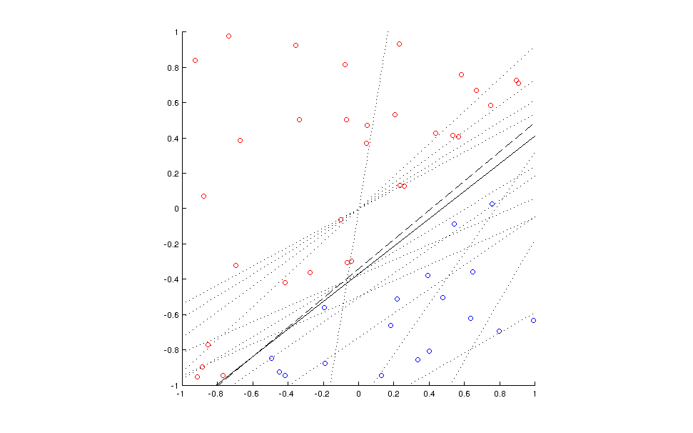

LearningFromData
================

## Learning From Data - CaltechX: CS1156x Learning From Data (introductory Machine Learning course)

## Homework 1 - Perceptron Learning Algorithm (PLA)

	To interact with the algorithm open the WatchPLA.m script.

	